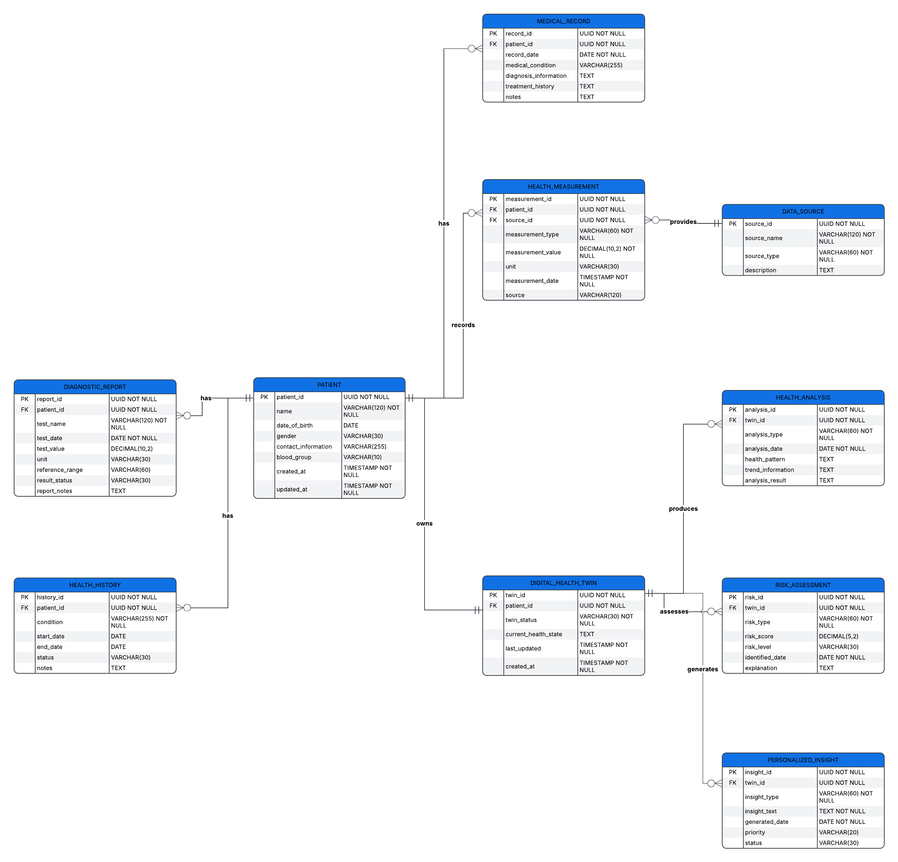

# System Architecture & Design

## 3.1 System Architecture

###  Architecture Overview

The proposed Digital Health Twin for Personalized Health Monitoring follows a modular architecture designed to collect, process, store, analyse and visualize patient health information.

The architecture integrates health data from multiple sources and processes it through different layers. The processed information is used to create a patient-specific health profile and Digital Health Twin. AI/ML-based analysis is then applied to identify health patterns and possible risk indicators. The resulting information is presented through a monitoring dashboard as personalized health insights.

The major architectural flow is:

```text
Health Data Sources
        ↓
Data Collection Layer
        ↓
Data Preprocessing Layer
        ↓
Patient Health Profile
        ↓
Digital Health Twin
        ↓
AI/ML Analysis
        ↓
Risk & Pattern Identification
        ↓
Personalized Health Insights
        ↓
Monitoring Dashboard

### 3.2 Module Architecture

```text
                    ┌─────────────────────────┐
                    │   Health Data Sources   │
                    └────────────┬────────────┘
                                 │
                                 ▼
                    ┌─────────────────────────┐
                    │ 1. Data Collection      │
                    │       Module            │
                    └────────────┬────────────┘
                                 │
                                 ▼
                    ┌─────────────────────────┐
                    │ 2. Data Preprocessing   │
                    │       Module            │
                    └────────────┬────────────┘
                                 │
                                 ▼
                    ┌─────────────────────────┐
                    │ 3. Patient Health       │
                    │    Profile Module       │
                    └────────────┬────────────┘
                                 │
                                 ▼
                    ┌─────────────────────────┐
                    │ 4. Digital Health Twin  │
                    │       Module            │
                    └────────────┬────────────┘
                                 │
                    ┌────────────┴────────────┐
                    │                         │
                    ▼                         ▼
          ┌──────────────────┐      ┌──────────────────────┐
          │ 5. AI/ML         │      │ 6. Risk & Pattern    │
          │    Analysis      │─────▶│    Identification    │
          └────────┬─────────┘      └──────────┬───────────┘
                   │                           │
                   └─────────────┬─────────────┘
                                 ▼
                    ┌─────────────────────────┐
                    │ 7. Personalized Health │
                    │       Insights          │
                    └────────────┬────────────┘
                                 │
                                 ▼
                    ┌─────────────────────────┐
                    │ 8. Backend / API        │
                    │       Module             │
                    └────────────┬────────────┘
                                 │
                                 ▼
                    ┌─────────────────────────┐
                    │ 9. Monitoring Dashboard │
                    └─────────────────────────┘


## 3.3 Database Design

### 3.3.1 Database Design Overview

The database design defines how patient health information, medical records, diagnostic reports, physiological measurements, health history, Digital Health Twin information, analysis results, risk assessments, and personalized insights are logically organized.

The database is designed around the patient as the central entity. Each patient's health information is connected to a patient-specific Digital Health Twin. The Digital Health Twin is continuously updated using new processed health data and acts as the central representation used for health analysis, risk identification, and personalized insights.

The database design follows these principles:

- Patient-centric organization of health data
- Clear separation of different health data types
- Primary and foreign key relationships for data integrity
- Support for historical health information
- Support for continuous Digital Twin updates
- Traceability between health data and analysis results
- Extensibility for additional health data sources
- Avoidance of unnecessary duplication of information

---

### 3.3.2 Entity Relationship Diagram

The Entity Relationship (ER) diagram represents the major entities of the Digital Health Twin system, their attributes, primary keys, foreign keys, and relationships.



**Figure 3.1: Entity Relationship Diagram of the Digital Health Twin System**

### 3.3.3 Main Database Entities

| Entity | Purpose |
|---|---|
| Patient | Stores the basic identity and profile information of a patient |
| Medical Record | Stores medical history and healthcare-related records |
| Diagnostic Report | Stores diagnostic and laboratory test information |
| Health Measurement | Stores physiological and health measurements |
| Health History | Stores historical health conditions and related information |
| Digital Health Twin | Stores the patient-specific Digital Twin representation |
| Health Analysis | Stores health pattern, trend, and analysis results |
| Risk Assessment | Stores identified health-related risk indicators and scores |
| Personalized Insight | Stores personalized monitoring insights generated from analysis |
| Data Source | Stores information about the source of health measurements |

---

### 3.3.4 Patient Entity

The `PATIENT` entity represents the central patient profile.

**Attributes:**

- `patient_id` — Primary Key
- `name` — Patient name
- `date_of_birth` — Date of birth
- `gender` — Gender information
- `contact_information` — Relevant contact information
- `blood_group` — Blood group
- `created_at` — Profile creation timestamp
- `updated_at` — Last profile update timestamp

The `patient_id` uniquely identifies each patient and is referenced by other patient-related entities.

---

### 3.3.5 Medical Record Entity

The `MEDICAL_RECORD` entity stores medical information associated with a patient.

**Attributes:**

- `record_id` — Primary Key
- `patient_id` — Foreign Key referencing `PATIENT`
- `record_date` — Date of the record
- `medical_condition` — Recorded medical condition
- `diagnosis_information` — Available diagnosis-related information
- `treatment_history` — Historical treatment information
- `notes` — Additional record information

A patient can have multiple medical records over time.

---

### 3.3.6 Diagnostic Report Entity

The `DIAGNOSTIC_REPORT` entity stores diagnostic and test-related information.

**Attributes:**

- `report_id` — Primary Key
- `patient_id` — Foreign Key referencing `PATIENT`
- `test_name` — Name of the diagnostic test
- `test_date` — Date of the test
- `test_value` — Recorded test value
- `unit` — Measurement unit
- `reference_range` — Reference range where applicable
- `result_status` — Result status
- `report_notes` — Additional report information

Multiple diagnostic reports can belong to a single patient.

---

### 3.3.7 Health Measurement Entity

The `HEALTH_MEASUREMENT` entity stores physiological or health measurements collected from different sources.

**Attributes:**

- `measurement_id` — Primary Key
- `patient_id` — Foreign Key referencing `PATIENT`
- `measurement_type` — Type of measurement
- `measurement_value` — Recorded value
- `unit` — Measurement unit
- `measurement_date` — Date and time of measurement
- `source` — Origin of the measurement

Examples of measurements may include supported physiological parameters collected from datasets, monitoring systems, or wearable devices.

---

### 3.3.8 Health History Entity

The `HEALTH_HISTORY` entity stores historical health conditions and related information.

**Attributes:**

- `history_id` — Primary Key
- `patient_id` — Foreign Key referencing `PATIENT`
- `condition` — Historical health condition
- `start_date` — Beginning date
- `end_date` — Ending date where applicable
- `status` — Current status of the condition
- `notes` — Additional information

This entity helps maintain a historical view of the patient's health information.

---

### 3.3.9 Digital Health Twin Entity

The `DIGITAL_HEALTH_TWIN` entity represents the patient-specific Digital Health Twin.

**Attributes:**

- `twin_id` — Primary Key
- `patient_id` — Foreign Key referencing `PATIENT`
- `twin_status` — Current status of the Digital Twin
- `current_health_state` — Current consolidated health state
- `last_updated` — Last update timestamp
- `created_at` — Twin creation timestamp

Each patient is associated with a patient-specific Digital Health Twin.

The Digital Health Twin is updated when relevant new health information is processed and incorporated into the patient's health profile.

---

### 3.3.10 Health Analysis Entity

The `HEALTH_ANALYSIS` entity stores analysis performed using information associated with the Digital Health Twin.

**Attributes:**

- `analysis_id` — Primary Key
- `twin_id` — Foreign Key referencing `DIGITAL_HEALTH_TWIN`
- `analysis_type` — Type of analysis
- `analysis_date` — Date of analysis
- `health_pattern` — Identified health pattern
- `trend_information` — Observed health trend
- `analysis_result` — Analysis output

Multiple analyses can be associated with a Digital Health Twin.

---

### 3.3.11 Risk Assessment Entity

The `RISK_ASSESSMENT` entity stores risk-related results generated from health analysis.

**Attributes:**

- `risk_id` — Primary Key
- `twin_id` — Foreign Key referencing `DIGITAL_HEALTH_TWIN`
- `risk_type` — Type of identified risk
- `risk_score` — Calculated risk score where applicable
- `risk_level` — Risk classification
- `identified_date` — Date of identification
- `explanation` — Explanation of the identified risk indicator

Risk assessment is intended for health monitoring and research purposes and should not be treated as an autonomous medical diagnosis.

---

### 3.3.12 Personalized Insight Entity

The `PERSONALIZED_INSIGHT` entity stores personalized information generated from the patient's health profile and Digital Health Twin.

**Attributes:**

- `insight_id` — Primary Key
- `twin_id` — Foreign Key referencing `DIGITAL_HEALTH_TWIN`
- `insight_type` — Type of insight
- `insight_text` — Generated insight
- `generated_date` — Date of generation
- `priority` — Priority level
- `status` — Insight status

These insights are presented through the monitoring dashboard to support personalized health monitoring.

---

### 3.3.13 Data Source Entity

The `DATA_SOURCE` entity identifies the source from which health measurements are obtained.

**Attributes:**

- `source_id` — Primary Key
- `source_name` — Name of the data source
- `source_type` — Type of source
- `description` — Description of the source

Possible source categories include wearable devices, sensors, medical systems, monitoring systems, and supported healthcare datasets.

---

### 3.3.14 Primary Key and Foreign Key Design

Primary keys uniquely identify individual records within an entity.

| Entity | Primary Key |
|---|---|
| PATIENT | `patient_id` |
| MEDICAL_RECORD | `record_id` |
| DIAGNOSTIC_REPORT | `report_id` |
| HEALTH_MEASUREMENT | `measurement_id` |
| HEALTH_HISTORY | `history_id` |
| DIGITAL_HEALTH_TWIN | `twin_id` |
| HEALTH_ANALYSIS | `analysis_id` |
| RISK_ASSESSMENT | `risk_id` |
| PERSONALIZED_INSIGHT | `insight_id` |
| DATA_SOURCE | `source_id` |

Foreign keys establish relationships between entities.

| Entity | Foreign Key | References |
|---|---|---|
| MEDICAL_RECORD | `patient_id` | `PATIENT.patient_id` |
| DIAGNOSTIC_REPORT | `patient_id` | `PATIENT.patient_id` |
| HEALTH_MEASUREMENT | `patient_id` | `PATIENT.patient_id` |
| HEALTH_HISTORY | `patient_id` | `PATIENT.patient_id` |
| DIGITAL_HEALTH_TWIN | `patient_id` | `PATIENT.patient_id` |
| HEALTH_ANALYSIS | `twin_id` | `DIGITAL_HEALTH_TWIN.twin_id` |
| RISK_ASSESSMENT | `twin_id` | `DIGITAL_HEALTH_TWIN.twin_id` |
| PERSONALIZED_INSIGHT | `twin_id` | `DIGITAL_HEALTH_TWIN.twin_id` |

---

### 3.3.15 Entity Relationships and Cardinality

The major relationships represented in the ER diagram are:

1. **Patient → Medical Record**
   - One patient can have multiple medical records.
   - Relationship: `1:N`

2. **Patient → Diagnostic Report**
   - One patient can have multiple diagnostic reports.
   - Relationship: `1:N`

3. **Patient → Health Measurement**
   - One patient can have multiple health measurements.
   - Relationship: `1:N`

4. **Patient → Health History**
   - One patient can have multiple historical health records.
   - Relationship: `1:N`

5. **Patient → Digital Health Twin**
   - One patient has one patient-specific Digital Health Twin.
   - Relationship: `1:1`

6. **Digital Health Twin → Health Analysis**
   - One Digital Health Twin can have multiple analysis records.
   - Relationship: `1:N`

7. **Digital Health Twin → Risk Assessment**
   - One Digital Health Twin can have multiple risk assessment records.
   - Relationship: `1:N`

8. **Digital Health Twin → Personalized Insight**
   - One Digital Health Twin can have multiple personalized insights.
   - Relationship: `1:N`

9. **Data Source → Health Measurement**
   - A data source can provide multiple health measurements.
   - Relationship: `1:N`

---

### 3.4.16 Database Design Considerations

The database design considers the following requirements:

- Patient data should be logically separated from analysis results.
- Historical records should be retained to support health trend analysis.
- New health measurements should be associated with the appropriate patient.
- Digital Twin information should be linked to the corresponding patient.
- Analysis and risk results should be associated with the Digital Health Twin.
- Personalized insights should be traceable to the relevant Digital Twin.
- Data source information should be maintained for measurement traceability.
- Sensitive health information should be protected using appropriate security mechanisms.
- Only anonymized or publicly available datasets should be used during development unless appropriate authorization exists.
- The design should allow additional health data types and sources to be incorporated in future versions.

---

### 3.3.17 Database Design Outcome

The proposed database design provides a structured representation of patient health information and its relationship with the Digital Health Twin.

The design supports:

- Centralized patient health information
- Historical health data management
- Diagnostic and physiological data storage
- Patient-specific Digital Twin representation
- Health trend and pattern analysis
- Risk indicator storage
- Personalized health insights
- Continuous health profile updates
- Traceability of health measurements and analysis

The database therefore provides the logical data foundation required for implementing the Digital Health Twin and personalized health monitoring workflow.

## 3.4 API Design

### 3.4.1 API Design Overview

The API layer provides communication between the frontend dashboard and the backend services of the Digital Health Twin system.

The API acts as an intermediate communication layer between the user interface, patient health data, Digital Health Twin, and analysis modules.

The main responsibilities of the API layer are:

- Receiving health-related data from the frontend
- Validating incoming requests
- Retrieving patient health information
- Providing processed health information to the dashboard
- Managing Digital Health Twin updates
- Providing health analysis results
- Providing risk assessment results
- Providing personalized insights
- Handling errors consistently
- Preventing direct access to internal backend logic from the frontend

The API design follows a modular approach so that individual services can be developed, tested, and extended independently.

---

### 3.4.2 API Communication Flow

The planned communication flow is:

```text
User
  |
  v
Frontend Dashboard
  |
  | HTTP Request
  v
Backend API
  |
  +--------------------+
  |                    |
  v                    v
Patient/Data       Digital Twin
Services           Services
  |                    |
  +----------+---------+
             |
             v
       AI/ML Services
             |
             v
      Analysis Results
             |
             v
       Backend API
             |
             | HTTP Response
             v
      Frontend Dashboard
             |
             v
            User


## 3.5 UI / Dashboard Design

### 3.5.1 UI Design Overview

The user interface provides a visual representation of the patient's health information, Digital Health Twin status, health trends, risk indicators, and personalized insights.

The dashboard is designed to provide a clear and organized view of patient-specific health information without overwhelming the user with unnecessary data.

The interface follows a clean, professional, healthcare-focused design approach.

The main design principles are:

- Simple and clear presentation
- Patient-centric information
- Data-driven visualization
- Consistent layout
- Clear health status indicators
- Responsive design
- Accessible interface
- Separation of information by functional sections

---

### 3.5.2 Primary Dashboard Users

The dashboard is primarily designed for:

1. **Patient**
   - View personal health information
   - Monitor health trends
   - View Digital Twin status
   - View personalized insights
   - Review risk indicators

2. **Healthcare Professional**
   - Review patient health profile
   - Observe health trends
   - Review risk indicators
   - Review analysis results
   - Monitor changes in the patient's Digital Twin

3. **Researcher**
   - Review processed health information
   - Observe analysis outputs
   - Evaluate Digital Twin behavior
   - Analyze system results

The exact access permissions can be expanded in future versions if authentication and role-based access control are implemented.

---

### 3.5.3 Dashboard Layout

The planned dashboard structure is:

```text
+-------------------------------------------------------------+
|                    Digital Health Twin                      |
+----------------+--------------------------------------------+
|                |                                            |
|   Navigation   |              Dashboard Header              |
|                |                                            |
|  Dashboard     +--------------------------------------------+
|  Health Data   |                                            |
|  Health Profile|          Patient Overview                   |
|  Digital Twin  |                                            |
|  Analysis      +------------------+-------------------------+
|  Risk          |                  |                         |
|  Insights      | Health Metrics   | Digital Twin Status     |
|                |                  |                         |
|                +------------------+-------------------------+
|                |                                            |
|                | Health Trends / Measurements               |
|                |                                            |
|                +--------------------------------------------+
|                |                                            |
|                | Risk Indicators                            |
|                |                                            |
|                +----------------------+---------------------+
|                |                      |                     |
|                | Personalized         | Recent Health      |
|                | Insights             | Updates            |
|                |                      |                     |
+----------------+----------------------+---------------------+

## 3.6 Security & Privacy Design

### 3.6.1 Security and Privacy Overview

The Digital Health Twin system deals with health-related information such as medical records, diagnostic reports, physiological measurements, health history, analysis results, and personalized insights.

Therefore, security and privacy are important design considerations throughout the system.

The security design focuses on:

- Protecting health-related information
- Preventing unauthorized access
- Protecting data during communication
- Validating incoming data
- Avoiding exposure of sensitive information
- Protecting application credentials and secrets
- Using appropriate data handling practices
- Supporting privacy-aware development and testing

The project is intended as a research and prototype system and is not designed to replace clinical security infrastructure or production healthcare systems.

---

### 3.6.2 Security Objectives

The main security objectives are:

1. **Confidentiality**
   - Prevent unauthorized access to health-related information.

2. **Integrity**
   - Prevent unauthorized or accidental modification of health data.

3. **Availability**
   - Ensure that authorized system components can access required information when needed.

4. **Privacy**
   - Minimize exposure of personal and health-related information.

5. **Traceability**
   - Maintain appropriate information about data updates and system operations where practical.

---

### 3.6.3 Data Privacy

Health-related information should be treated as sensitive data.

During development and testing, the project should preferably use:

- Public healthcare datasets
- Anonymized datasets
- Synthetic data where appropriate
- De-identified patient information

Real patient medical records should not be added to the repository or development environment without appropriate authorization.

The system should also avoid collecting unnecessary personal information.

Only information required for the project's intended functionality should be stored and processed.

---

### 3.6.4 Data Protection

The system should protect health data throughout its lifecycle.

The general data protection flow is:

```text
Health Data
    |
    v
Data Collection
    |
    v
Input Validation
    |
    v
Data Preprocessing
    |
    v
Secure Storage
    |
    v
Controlled Processing
    |
    v
Analysis / Digital Twin
    |
    v
Controlled Presentation

## 3.7 Technology Stack & Implementation Design

### 3.7.1 Technology Stack Overview

The Digital Health Twin system requires technologies for data processing, machine learning, backend API development, frontend development, data storage, visualization, testing, and version control.

The technology stack is organized according to the different system modules rather than using a single technology for the complete application.

The planned technology areas are:

- Python for data processing and AI/ML development
- Pandas and NumPy for health data processing
- Scikit-learn for machine learning
- React and JavaScript for the frontend dashboard
- Backend API framework for communication between frontend and backend
- Database technology for structured health information
- Charting/visualization libraries for dashboard visualization
- Git and GitHub for version control
- Testing tools for module and system validation

The final choice of specific frameworks or database technologies may be refined during implementation.

---

### 3.7.2 Technology Stack

| System Area | Planned Technology | Purpose |
|---|---|---|
| Programming Language | Python | Data processing, preprocessing and AI/ML |
| Data Processing | Pandas | Data loading, cleaning and transformation |
| Numerical Processing | NumPy | Numerical operations and feature processing |
| Machine Learning | Scikit-learn | ML model development and evaluation |
| Frontend | React | Interactive monitoring dashboard |
| Frontend Language | JavaScript | Frontend application logic |
| Backend | Python-based API | Communication between frontend and backend |
| Database | Database system | Storage of structured health information |
| Visualization | Charting library | Health trends and data visualization |
| Version Control | Git | Source code version control |
| Repository | GitHub | Code hosting and collaboration |
| Development Environment | VS Code | Development and project management |

---

### 3.7.3 Python

Python is planned as the primary programming language for data processing and AI/ML components.

Python is suitable for the project because it provides libraries for:

- Data preprocessing
- Numerical computation
- Machine learning
- Dataset analysis
- Model evaluation
- Backend development

Python will primarily be used within the following areas:

```text
Data Processing
       |
       v
Preprocessing
       |
       v
Feature Preparation
       |
       v
AI/ML Models
       |
       v
Analysis Results
       |
       v
Backend Services

